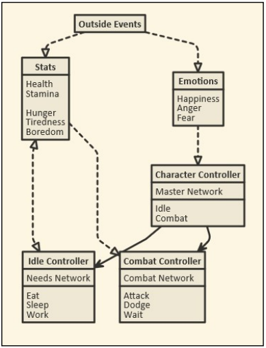

 
For my final year project I undertook the task of researching the viability of using neural networks to drive npc behavior in a single player experience and then create a solution which not only worked but performed better, on average, than existing solutions such as behavior trees or finite state machines. After a year of hard work, I am proud to present Organic Non-playable characters!
 
<iframe width="560" height="315" src="https://www.youtube.com/embed/nAxArUUPL_A" frameborder="0" allow="accelerometer; autoplay; encrypted-media; gyroscope; picture-in-picture" allowfullscreen></iframe>
 
---
### About
Neural networks had started picking up traction in the video game space a few years ago when developers realised that they could use image recognition to train a computer to beat classic video games such as mario or even [drive cars in GTA](https://www.youtube.com/watch?v=rvnHikUJ9T0). Hype grew further when it was announced that EA were working with NNs to develop AI for their upcoming battlefield game, and it was [this video](https://www.youtube.com/watch?v=BdtQxAvTwA4) that got me interested on the subject. This was also the year that [Elon musk's openAI project](https://www.theverge.com/2019/4/13/18309459/openai-five-dota-2-finals-ai-bot-competition-og-e-sports-the-international-champion) first beat a professional team in the e-sports title DoTA 2 (A game I am very fond of). 
 
With all this said, neural networks had never been used in a purely single player approach, where the goal wasn't to necessarily beat the player but to act like realistic, living, breathing organisms, each with their own goals and motivations. Therefore, my goal was to create 'sims like' NPCs that could be plugged into an open-world rpg setting and aid with the immersion of the player.


 
This was achieved by using a series of neural networks all trained independently to achieve separate goals (Such as combat, idle activity, goal management) working together under one master network that would decide at any given moment what the NPC should be doing. This included eating, sleeping, going to work, socialising with other NPCs and the player, and even fighting when allies were under attack or laws were being broken.

 
For additional reading on this project, my final report can be read [here](/pdf/OrganicNPCsCopy.pdf).
 
### My final project includes;
- A series of neural networks designed to work together in a tree.
- Scripts that allow for the creation of more NNs, and therefore the addition of new AI behavior, without any hassle
- A fully featured training script that allows the developers to set targets for the network, view data output in real time and correct errors on the fly
- A basic starting environment featuring 3 factions (Guards, barbarians and neutrals) all working with their own goals and desires
 
This project was coded in C# by myself over the course of my final year in university. The original unity project can be viewed and downloaded from my github repository [here](https://github.com/JohnnersUK/Organic-NPCs).
 
 

