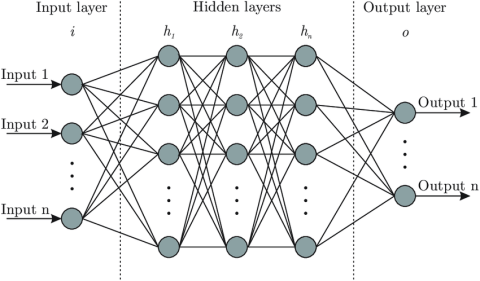
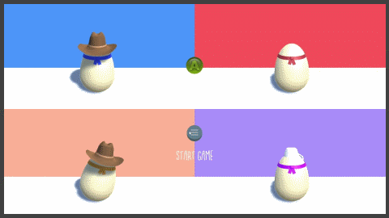
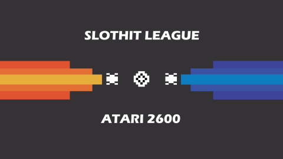

# Welcome to my portfolio!

## Recent Projects 

### [Neural networks and NPCs](OrganicNonPlayableCharacters.md)
My final year project: Using neural networks to train NPC behavior.

---
## Game Jams
### [Eggsassination](/Eggsassination.md)

Don't crack under the pressure!
Roll your way to victory in this manic 4 player party game!

### [Slothit League](/Slothit-League.md)

A 1980's demake of the popular video game 'Rocket League'.

---
## Unity technologies
### [Open worlds in Unity](/OpenWorldsInUnity.md)
Develop seamless open worlds in Unity 3D.

### [Destruction physics in Unity](/DestructionPhysics.md)
Create earth quaking explosions in unity 3D.

---

## Other projects
### [Squad engine](SquadEngine.md)
Squad engine is a light, 2D game engine made for university projects.

### [ASGE projects](ASGEProjects.md)
Using OpenGl and c++ to develop and test 2D game mechanics.

### [Qt 5.15 development](Qt.md)
A brief trip down software development avenue.

---
