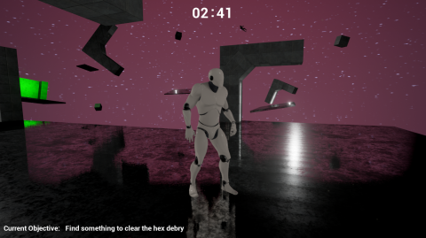

# Welcome to my portfolio!

## Recent Projects 

### [Neural networks and NPCs](/pdf/OrganicNonPlayableCharacters.md)
My final year project: Using neural networks to train NPC behaviour.

---

### [Slothit League](/Slothit-League.md)

A 1980's demake of the popular video game 'Rocket League'

---

### [Space Place](/Space-Place-Project.md)
Cosmic horror in 5 minutes!

---

### Other things I've worked on

- [Project 1 Title](http://example.com/)
- [Project 2 Title](http://example.com/)
- [Project 3 Title](http://example.com/)
- [Project 4 Title](http://example.com/)
- [Project 5 Title](http://example.com/)

---

updating just to be safe...