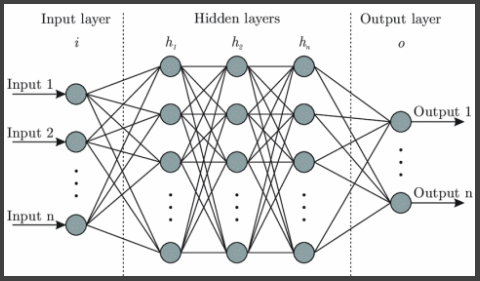

# Welcome to my portfolio!

## Recent Projects 

### [Neural networks and NPCs](OrganicNonPlayableCharacters.md)
My final year project: Using neural networks to train NPC behaviour.

---
## Unity Projects
### [Eggsassination](/Eggsassination.md)

Don't crack under the pressure!
Roll your way to victory in this manic 4 player party game!

### [Slothit League](/Slothit-League.md)

A 1980's demake of the popular video game 'Rocket League'

---

### [Open worlds in Unity](/OpenWorldsInUnity.md)
Develop seamless open worlds in Unity 3D

---

### Other things I've worked on

- [Destruction physics in Unity 3D](/DestructionPhysics.md)
- [Space Place](/SpacePlaceProject.md)

---
